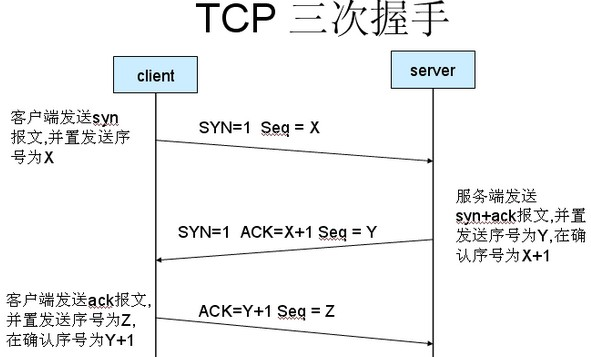

DDOS
---
关于DDOS和DOS 一个群殴一个单挑.
当HTTP的Content-Length伪造值大于实际Body长度服务器应如何处理？
最近写了一个HTTP server ，在写的过程中发现了一个问题:
因为HTTP 1.1支持TCP长连接，当服务器接收请求时需要获取头中的content-length ，从而确定接下来还需要获取的body长度，使得可以切分同一个连接上的不同请求。如果伪造Content-Length 使其大于实际body长度，会导致服务器一直在等待还未接收到的字节流。
经过实际实验发现，貌似无论iis还是nginx 处理这个问题貌似都是让连接长时间等待直到超时服务器主动断开连接。感觉这个问题有点像慢连接导致的Dos攻击。
现在主流web server应对这一问题是否只有超时断开这一手段？利用这一特性进行DDos攻击是否可行？一般采取的防范手段是什么？
超时+连接数限制吧，，，连接多了就废掉最早的，
举一个最通俗的例子，下面的图片是TCP的通信的三次握手，如果说攻击端，发送完第一次握手的数据后，然后就“消失”了，那么服务器就会不断的发送第二次握手的数据，可是攻击端的人找不到了。于是，服务器的资源大量被消耗，直到死机为止。当然要完全弄懂机制，需要对TCP有相当深入的了解。

事实上DOS的攻击方式有很多种，比如下面的常见的：1、SYN FLOOD　　利用服务器的连接缓冲区（Backlog Queue），利用特殊的程序，设置TCP的Header，向服务器端不断地成倍发送只有SYN标志的TCP连接请求。当服务器接收的时候，都认为是没有建立起来的连接请求，于是为这些请求建立会话，排到缓冲区队列中。 　　如果你的SYN请求超过了服务器能容纳的限度，缓冲区队列满，那么服务器就不再接收新的请求了。其他合法用户的连接都被拒绝掉。可以持续你的SYN请求发送，直到缓冲区中都是你的只有SYN标记的请求。 　　2、IP欺骗DOS攻击　　这种攻击利用RST位来实现。假设现在有一个合法用户(1.1.1.1)已经同服务器建立了正常的连接，攻击者构造攻击的TCP数据，伪装自己的IP为1.1.1.1，并向服务器发送一个带有RST位的TCP数据段。服务器接收到这样的数据后，认为从1.1.1.1发送的连接有错误，就会清空缓冲区中建立好的连接。这时，如果合法用户1.1.1.1再发送合法数据，服务器就已经没有这样的连接了，该用户就必须从新开始建立连接。 　　攻击时，伪造大量的IP地址，向目标发送RST数据，使服务器不对合法用户服务。 　　 　　3、带宽DOS攻击　　如果你的连接带宽足够大而服务器又不是很大，你可以发送请求，来消耗服务器的缓冲区消耗服务器的带宽。这种攻击就是人多力量大了，配合上SYN一起实施DOS，威力巨大。不过是初级DOS攻击。 
4、自身消耗的DOS攻击　　这是一种老式的攻击手法。说老式，是因为老式的系统有这样的自身BUG。比如Win95 (winsock v1), Cisco IOS v.10.x, 和其他过时的系统。　　这种DOS攻击就是把请求客户端IP和端口弄成主机的IP端口相同，发送给主机。使得主机给自己发送TCP请求和连接。这种主机的漏洞会很快把资源消耗光。直接导致当机。这中伪装对一些身份认证系统还是威胁巨大的。
   上面这些实施DOS攻击的手段最主要的就是构造需要的TCP数据，充分利用TCP协议。这些攻击方法都是建立在TCP基础上的。还有其他的DOS攻击手段。 　　 　　5、塞满服务器的硬盘　　通常，如果服务器可以没有限制地执行写操作，那么都能成为塞满硬盘造成DOS攻击的途径，比如： 　　发送垃圾邮件。一般公司的服务器可能把邮件服务器和WEB服务器都放在一起。破坏者可以发送大量的垃圾邮件，这些邮件可能都塞在一个邮件队列中或者就是坏邮件队列中，直到邮箱被撑破或者把硬盘塞满。 　　让日志记录满。入侵者可以构造大量的错误信息发送出来，服务器记录这些错误，可能就造成日志文件非常庞大，甚至会塞满硬盘。同时会让管理员痛苦地面对大量的日志，甚至就不能发现入侵者真正的入侵途径。　　向匿名FTP塞垃圾文件。这样也可以塞满硬盘空间。 　　 
